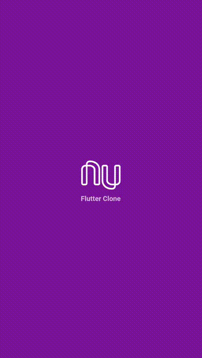

<h1 align="center">
  Nubank - Flutter Clone
</h1>

## 🚀 Sobre o projeto

Esse projeto possui fins educativos.

Se trata de um clone da aplicação Android da Nubank, os icones foram obtidos através
de engenharia reversa ([JADX](https://github.com/skylot/jadx)) e não encontram-se disponiveis nesse repositório.

O aplicativo é totalmente funcional mas há a necessidade de alterar os icones utilizados
para primeira compilação. Você pode utilizar os icones do Material
Design, as commits iniciais possuem eles.

Para obter ajuda sobre como iniciar o Flutter, consulte a [documentação on-line](https://flutter.dev/).

## 👨‍💻 Preview

## 💻 Tecnologias

Libs e tecnologias utilizadas no desenvolvimento:
  qr_flutter: ^3.2.0
  provider: ^4.0.4
  rxdart: ^0.23.1
- [x] [Dart](https://github.com/dart-lang)
- [x] [Flutter](https://github.com/flutter)
- [x] [Provider](https://github.com/rrousselGit/provider)
- [x] [RxDart](https://github.com/ReactiveX/rxdart)
- [x] [QR Flutter](https://github.com/lukef/qr.flutter)

## 📝 Licença

Esse projeto está sob a licença MIT. Veja o arquivo [LICENSE](LICENSE.md) para mais detalhes.

---

Feito com ♥️ by Brendenson -  [Github](https://github.com/trylix/) | [LinkedIn](https://www.linkedin.com/in/dobrendenson/)